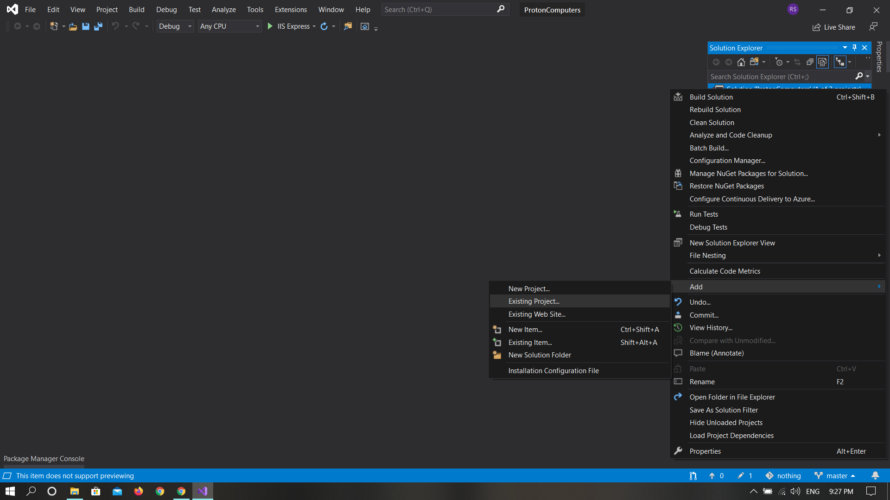

# Assignment-1
This Website Provide Computer Hardware Products to Customers. From this website customers can purchase various computer hardware parts like Rams, Motherboards, CPU coolers and many more.
It has to options on nav bar one is for adding products and one for manufacturers. Link to the website with working database.
- **Azure Link**: https://protoncomputers20.azurewebsites.net
# Assignment-2 Part-1
1. Used Identity.sql script to create the necessary ASPNET Identity tables in database.
   - Configured Identity in Startup.cs.
   - Changed DbContext class so it inherits from IdentityDbContext.

2. Used Authentication 
   - Register and Login show when the user is anonymous. Done
   - Register and Login are replaced in the header by the username and Logout when the user is authenticated. Done 
   - Created an account with these credentials:
     - marie@gc.ca / Test123$
   - Only authenticated users can now add, edit and delete data.
   - Only anonymous users can view the list of data but cannot see the Create, Edit, or Delete links.

3. Added Social Authentication with **Google**.
   - Google Authentication Working on Both Local and Online Environment.
   - Stored All the Api Keys in **appsettings.json** file rather than inside the C# code.

4. Github
   - Used **.gitignore** so the Packages folder does not get included in your online repository.

5. Azure
   - Publish to the site to Azure or any other web server that supports ASP.NET and SQL Server. Include this link in your README.md file.
     - **Azure Link**: https://protoncomputers20.azurewebsites.net
- Bonus
  - Added **Twitter** Login on Both Local and Online Environment.

# Assignment-2 Part-2

#### After Cloning the Project Follow these steps-
1. You will get this error when you first open the project. Click OK.

2. As you can see ProtonComputerTests solution is Unloaded(Above Green Line).
 
3. Right Click on it and Then Click Remove to remove it from project.

4. Now Right Click on Main Project Solution in my case it is Proton Computers, then click on Add>Existing Project.
 
5. Then locate the sub-dir included in the project and select ProtonComputersTets.csproj from it and click open.

6. As you can see unit test solution is loaded but there is yellow warning triangle on the dependencies which means we are refering wrong project solution.
 
7. To get rid of yellow triangle go in dependencies and then into projects and remove the existing reference of the project using right click and remove action. As Shown in Image.

8. Right After removing old reference Right click on Dependencies and Click Add Reference.
 
9. Select the Project from the list and click OK.As shown in Image.

10. As you can see there is no yellow warning triangle now.
 
11. Now when you run the project you will get these errors. 

12. To Eliminate these errors just click on any file and delete the highlighed code from the file even if the file is different from the screenshot.
 
Just Like the Image below.

13. Now You can run the project and all test will run as shown below.

### Summary of Assignment-2 Part-2
1. Created a Unit Testing project within my main project solution.
2. Added Unit Tests for Home, manufacturers and Products Controllers.
3. Covered Index, Details methods to test as much scenarios i can.

# Assignment-2 Part-3
  - Implemented and Tested Full Create-Read-Update-Delete functionality for ManufacturersController. 
  - There is one Additional Products Api controller also available. But i didnot tested it. So please test only **ManufacturersController**.
  - **Azure Link**: https://protoncomputers20.azurewebsites.net
   